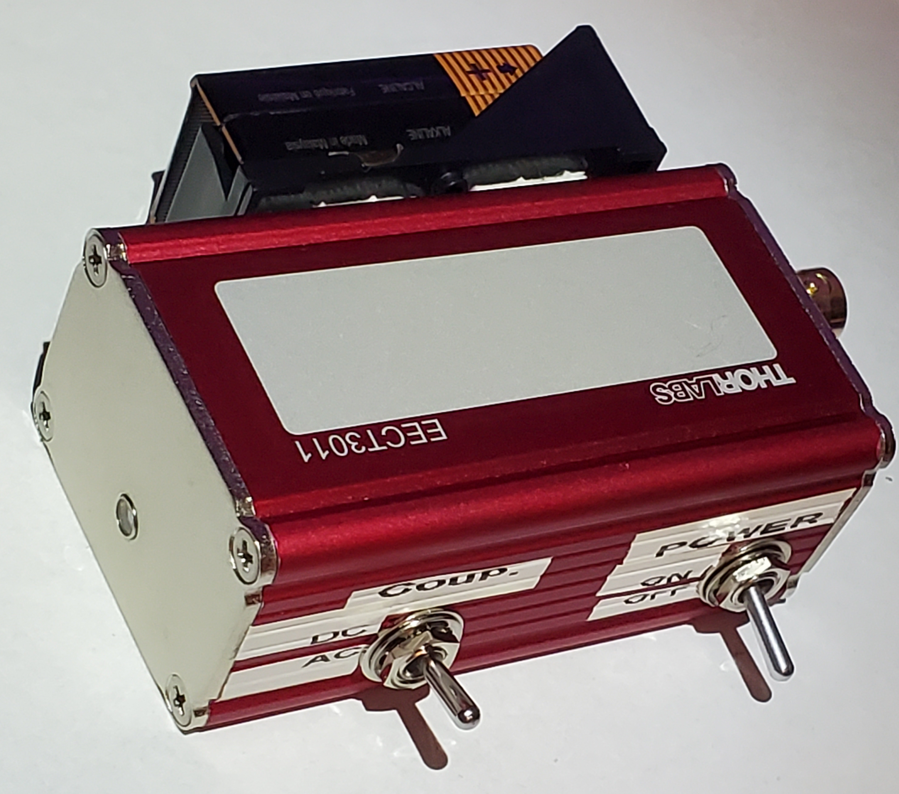

# Battery-Powered, Amplified Photodetector

A battery-powered photodetector design which runs off a 9V battery, with +-12V max output. Designed specifically for the Thorlabs EECT3011 enclosure.

The most inconvenient aspect of setting up an amplified photodetector in an experiment usually turns out to be finding a bipolar power supply and arranging the proper connections to the board. With this design, the only connection required is the BNC connection to the oscilloscope!

The enclosure used is the EECT3011 from Thorlabs, which is offered currently at around 31 USD. The design is provided as two KiCAD board files, a parts list, and assembly instructions.

<p align="center">
  
</p>

*Completed photodetector assembly.*

<p align="center">
  
</p>

*Completed assembly with top and front panels removed.*

<p align="center">
  
</p>

*In addition to the two custom boards (provided as KiCad Files), the build requires an output connector, a battery holder, a power switch, an (optional) coupling switch, and of course the photodiode + enclosure.*

---

## Repository Contents

```
.
├── KiCAD/                     # KiCAD Project Files
├── ASSEMBLY INSTRUCTIONS.pdf  # Detailed Assembly Instructions
├── tex/                       # Assembly Instructions source code
```

---

## Why Use an Amplified Detector?

Compared to a simple resistor-loaded photodiode, a transimpedance amplifier offers:

- Greater sensitivity (depending on chosen transimpedance)
- Improved linearity by maintaining constant photodiode bias
- Reduced sensitivity to cable capacitance and external loading
- Better compatability with equipment (can be 50 ohm terminated)

In order to power the transimpedance amplifier, a DC-DC converter board is included as part of the design. This board converts the 9V input from the battery into a regulated $\pm$12V bipolar power supply usable by the transimpedance amplifier board.

## Why This Detector?

- This detector solves one of the greatest inconveniences with amplified photodetectors: powering them. By moving the entire power supply on-board via a 9V battery and custom, regulated DC/DC converter circuit, similar performance to commercial photodetectors can be obtained without the extra power cable!

- This detector costs approximately 50 USD to construct, including the housing, and minus the cost of the photodiode. This is far cheaper than any amplified photodetector currently offered on Thorlabs' website.

- Since we are using a standard enclosure, various mounting brackets and options are available for mounting the photodetector to an optical breadboard.

---

## KiCAD Project Files

The two boards necessary for building the photodetector are included as `.zip` files in the `KiCAD/` folder. These files are generated by the "Archive Project" function in KiCAD, and should be loaded using the "Unarchive Project" function in KiCAD.

## Assembly Instructions

Assembly instructions are provided in the `ASSEMBLY INSTRUCTIONS.pdf` file.
